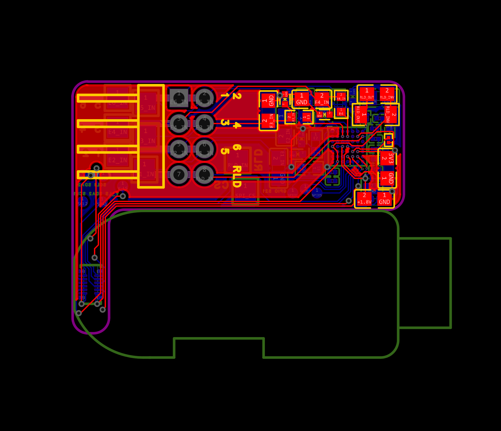
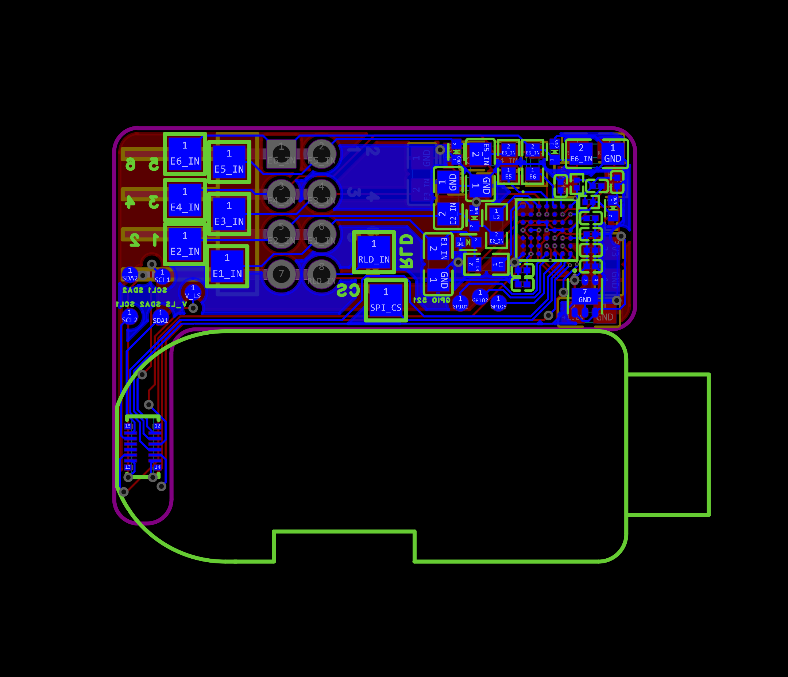
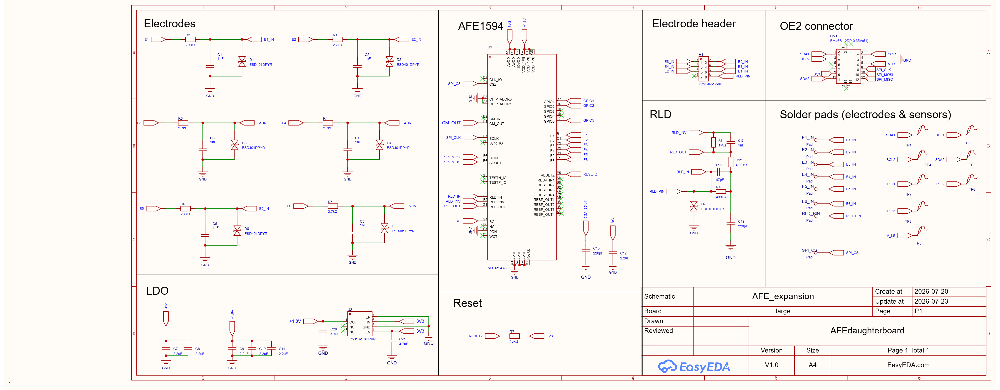

# OpenEarable 2.0 ExG AFE1594 Expansion Board

Expansion board to replace the original AD7124 expansion board for the OpenEarable 2.0. This board features 4 channels with 6 electrode pins. The design features configurable gain settings and a right leg drive with a dedicated output pin.

## Repository Structure

```
TECO-glasses/ (branch: afe-expansion-board)
└── pcb/       EasyEDA project, schematic, and board layout files
```

## PCB (`/pcb`)

Analog front-end board designed in EasyEDA Pro.

| File                                         | Description                                      |
| -------------------------------------------- | ------------------------------------------------ |
| `AFE_expansion_board.epro2`                  | EasyEDA Pro source project (primary design file) |
| `AFE_expansion_board_schematic.pdf` / `.png` | Circuit schematic                                |
| `AFE_expansion_board_pcb.pdf`                | Full PCB layout                                  |
| `AFE_expansion_board_pcb_t.png`              | Board top view                                   |
| `AFE_expansion_board_pcb_b.png`              | Board bottom view                                |

<p float="left">
  
  
</p>



Note: for this board, the GPIO 1 pin and the CS pin must be soldered onto the board and inserted into the header on the OE board because the OE does not expose enough GPIO lines through the connector.

## Firmware

The firmware for this version is incomplte. The AFE1594 library is complete but has not yet been implemented for the OpenEarable 2.0. The firmware for the OpenEarable 2.0 can be on the `ExG` branch of the [OpenEarable2 GitHub repository](https://github.com/OpenEarable/open-earable-2).

## Todo

The firmware requires updates to function properly with the new AFE1594 library.
