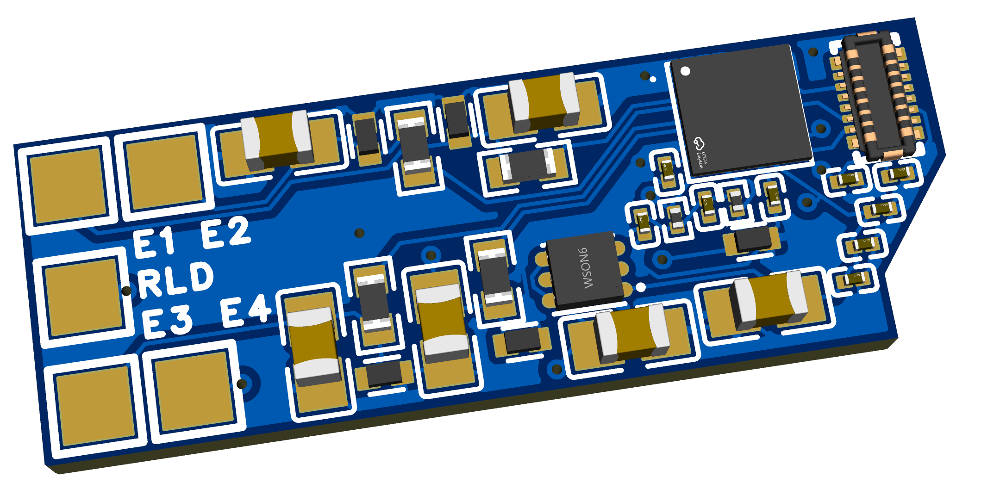
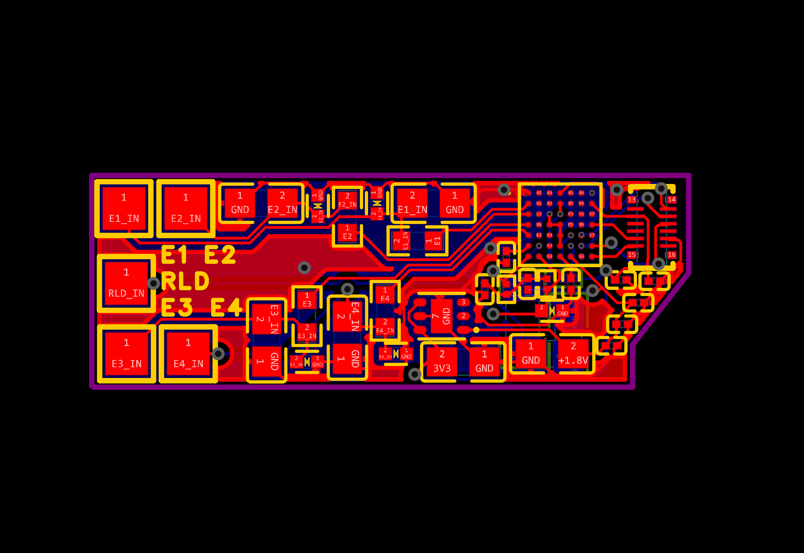
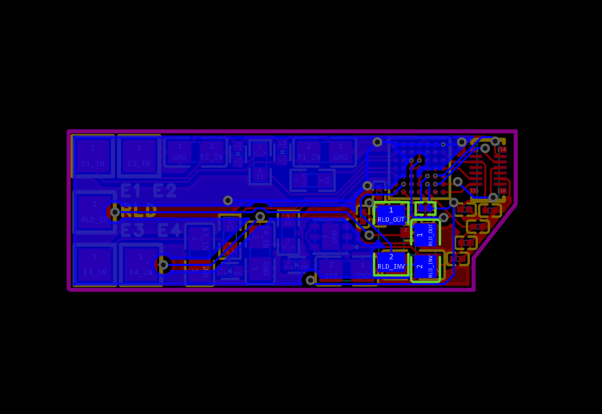
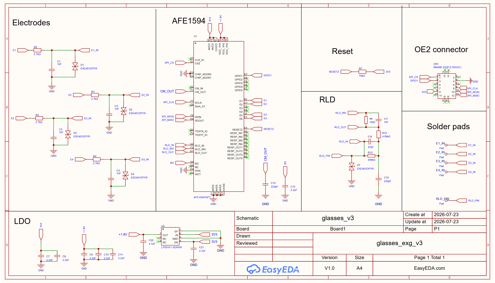

# OpenEarable ExG Glasses (v3.0)

Open-source hardware, CAD, and client software for biopotential (EOG/EXG) sensing built into an eyeglasses form factor, extending the OpenEarable 2.0 platform. This version uses identical 3D models and client software to version two. However, version 3.0 is based on the AFE1594 ADC enabling superior signal quality, higher channel counts, in a more efficient form factor. This version is incomplete.

<p>
  
</p>

## Repository Structure

```
TECO-glasses/ (branch: v_three)
└── pcb/       EasyEDA project, schematic, and board layout files
```

## PCB (`/pcb`)

Analog front-end board designed in EasyEDA Pro.

| File                                | Description                                      |
| ----------------------------------- | ------------------------------------------------ |
| `glasses_v3.epro2`                  | EasyEDA Pro source project (primary design file) |
| `glasses_v3_schematic.pdf` / `.png` | Circuit schematic                                |
| `glasses_v3_pcb.pdf`                | Full PCB layout                                  |
| `glasses_v3_pcb_t.png`              | Board top view                                   |
| `glasses_v3_pcb_b.png`              | Board bottom view                                |
| `glasses_v3.png`                    | 3D rendering of the board                        |

<p float="left">
  
  
</p>



## Firmware

The firmware for this version is incomplte. The AFE1594 library is complete but has not yet been implemented for the OpenEarable 2.0. The firmware for the OpenEarable 2.0 can be on the `ExG` branch of the [OpenEarable2 GitHub repository](https://github.com/OpenEarable/open-earable-2).

## Todo

The firmware requires updates to function properly with the new AFE1594 library.
