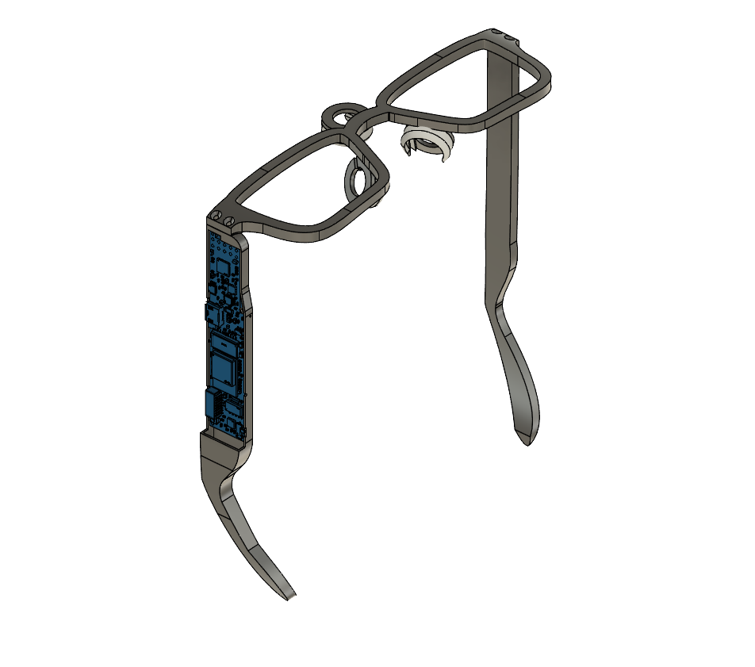
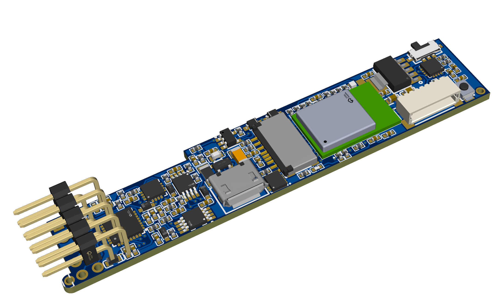

# OpenEarable ExG Glasses — Version 1 (`v1`)

**v_one** branch of the **OpenEarable ExG Glasses** project. This repository contains the hardware design, embedded firmware, diagnostic tools, and Python client applications for acquiring, filtering, and processing electrooculography (EOG) / electroexg (ExG) biopotential signals in a glasses form factor.

<p align="center">
  
  
</p>

---

## Overview

This branch contains the initial hardware iteration (`v1`) of the OpenEarable ExG frame and custom PCB:

- **CAD Assembly** — custom frame files designed for wearable biopotential sensing
- **Custom PCB** — EasyEDA Pro hardware designs and manufacturing documents
- **Firmware** — a drop-in replacement for the official [OpenEarable ExG firmware](https://github.com/OpenEarable/open-earable-ExG/tree/main)
- **Client & ML Suite** — real-time BLE visualization, DSP filtering, diagnostics, and a Random Forest classification pipeline for EOG signals

---

## Repository Structure

```text
.
├── cad/
│   ├── glasses_v1.f3z         # Fusion 360 CAD assembly file
│   └── glasses_v1.png         # CAD assembly render (hero image)
├── pcb/
│   ├── glasses_v1.png         # 3D rendering of the PCB
│   ├── glasses_v1.epro2       # EasyEDA Pro project source file
│   ├── glasses_v1_pcb.pdf     # Circuit schematic and layout PDF
│   ├── glasses_v1_pcb_t.png   # PCB top layer photo/render
│   └── glasses_v1_pcb_b.png   # PCB bottom layer photo/render
├── firmware/
│   └── main.cpp               # Drop-in firmware replacement for OpenEarable ExG
└── client/
    ├── record_and_realtime_plot_BLE.py  # Primary BLE streaming & plotting client
    ├── digitalfilter.py                 # EOG digital filtering library
    ├── features.py                      # Feature extraction & debugging script
    ├── samplers_per_second.py           # Sampling rate diagnostic tool
    ├── freq_check.py                    # Frequency & FFT validation tool
    ├── train.py                         # Random Forest model training script
    ├── trial.py                         # Model trial / evaluation script
    ├── window_visualize.py              # Windowing & segmentation inspector
    └── data_visualize.py                # Raw & processed dataset visualizer
```

---

## Hardware & Design

### Mechanical CAD (`/cad`)

- `glasses_v1.f3z` — master 3D assembly in Fusion 360 format, containing the mechanical geometry and component integration for the wearable frame
- `glasses_v1.png` — high-resolution CAD render of the assembled frame

### Printed Circuit Board (`/pcb`)

The biopotential sensing board is designed to interface directly with the frame assembly.

- `glasses_v1.epro2` — primary design source file, created in EasyEDA Pro
- `glasses_v1_pcb.pdf` — complete schematic and PCB layout reference
- `glasses_v1_pcb_t.png` / `glasses_v1_pcb_b.png` — top and bottom layer board previews

---

## Firmware (`/firmware`)

`main.cpp` is a drop-in replacement for the original `main.cpp` in the official OpenEarable ExG repository.

**To flash:**

1. Clone the official [OpenEarable ExG firmware repository](https://github.com/OpenEarable/open-earable-ExG/tree/main).
2. Replace its `main.cpp` with `firmware/main.cpp` from this repository.
3. Build and flash using PlatformIO.

---

## Client Software & Data Pipeline (`/client`)

Tools for real-time BLE data acquisition, signal processing, hardware diagnostics, and machine learning.

### Data Streaming & Filtering

- `record_and_realtime_plot_BLE.py` — primary client; connects over BLE, streams ExG/EOG channels, and visualizes waveforms in real time
- `digitalfilter.py` — digital filtering pipelines (bandpass, notch, baseline wander removal) tuned for EOG eye-movement signals

### Diagnostics & Debugging

- `samplers_per_second.py` — benchmarks throughput and sampling rate stability over BLE
- `freq_check.py` — FFT-based spectrum analysis to detect mains noise (50/60 Hz) or signal distortion
- `features.py` — extracts time-domain and frequency-domain features from windows of ExG data
- `BLE Scanner.py` - scans through all BLE sources and outputs the BLE address for the Open Earable device

### Machine Learning Pipeline (Random Forest v1)

Initial classifier pipeline for detecting and categorizing EOG eye movements (blinks, saccades, etc.):

- `data_visualize.py` — plot and review raw/filtered dataset recordings
- `window_visualize.py` — inspect sliding windows and segmentation boundaries across labeled streams
- `train.py` — trains the v1 Random Forest model on extracted features
- `trial.py` — runs inference trials against saved recordings or live streams to validate model performance

---

## Quick Start

### Prerequisites

- Python 3.9+
- Required packages:

  ```bash
  pip install bleak numpy scipy matplotlib scikit-learn pandas
  ```

### Real-Time BLE Visualization

1. Power on the glasses and confirm they are running v1 firmware.
2. Launch the streaming client:

   ```bash
   python client/record_and_realtime_plot_BLE.py
   ```

3. Note: you may need to edit the BLE address in `record_and_realtime_plot_BLE.py`, to do so use `BLE Scanner.py` to determine the new value
