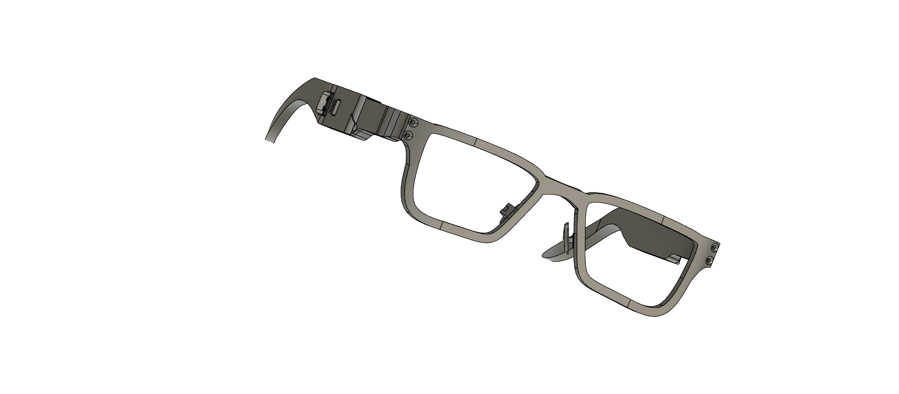
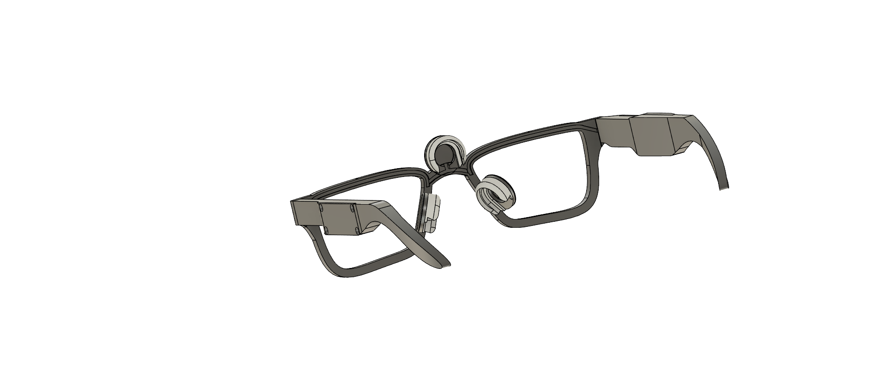
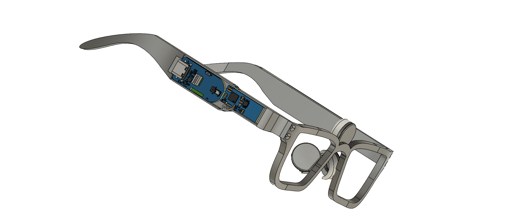
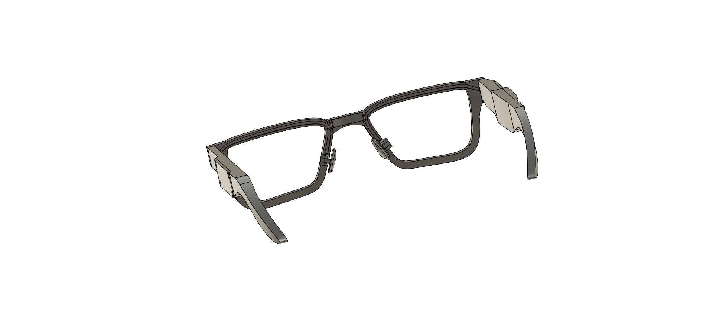
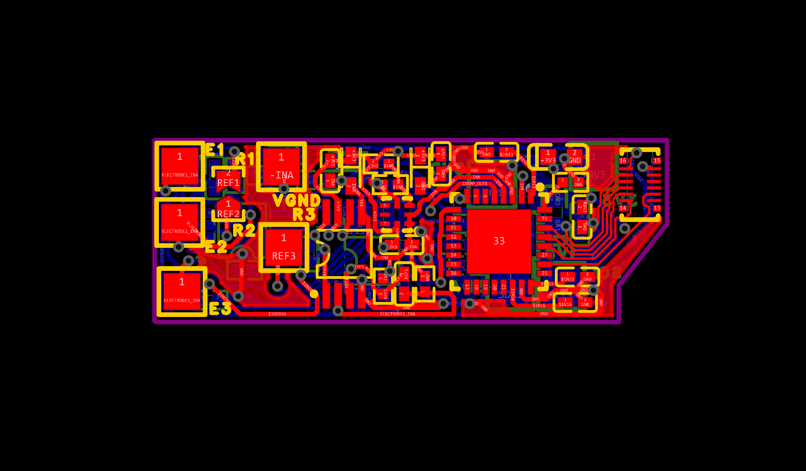
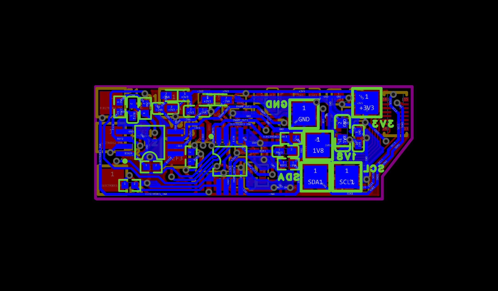
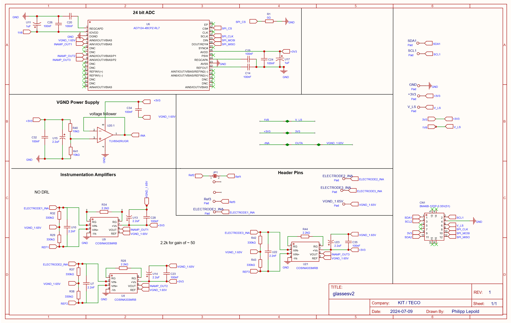

# OpenEarable ExG Glasses (v2.0)

Open-source hardware, CAD, and client software for biopotential (EOG/EXG) sensing built into an eyeglasses form factor, extending the OpenEarable platform.

<p>
  
</p>

## Repository Structure

```
open-earable-2-exg/ (branch: v_two)
├── cad/       Fusion 360 assemblies and render images
├── client/    Python BLE client, filtering, and live plotting
└── pcb/       EasyEDA project, schematic, and board layout files
```

## CAD (`/cad`)

Design iterations `a` through `e`, saved as Fusion 360 archives (`glasses_assembly_v2_{letter}.f3z`).

- **Version a** — uses Datwyler soft pulse electrodes with standard electrode clips.
- **Versions b–e** — use 3D-printed metal electrodes integrated into the frame.

| File                                                  | Description                                            |
| ----------------------------------------------------- | ------------------------------------------------------ |
| `glasses_assembly_v2_a_1.png`, `_a_2.png`, `_a_3.png` | Version a, soft pulse electrode assembly               |
| `glasses_assembly_v2_e.png`                           | Version e, main assembly (3D-printed metal electrodes) |
| `glasses_assembly_v2_e_2.png`                         | Version e, alternate view                              |
| `glasses_assembly_v2_{a-e}.f3z`                       | Fusion 360 source files per version                    |

<p float="left">
  
  
  
  <sub>Version (a) main assembly.</sub>
</p>

<p float="left">
  
  
  <sub>Version e main assembly with 3D-printed metal electrodes.</sub>
</p>

## PCB (`/pcb`)

Analog front-end board designed in EasyEDA Pro.

| File                                | Description                                      |
| ----------------------------------- | ------------------------------------------------ |
| `glasses_v2.epro2`                  | EasyEDA Pro source project (primary design file) |
| `glasses_v2_schematic.pdf` / `.png` | Circuit schematic                                |
| `glasses_v2_pcb.pdf`                | Full PCB layout                                  |
| `glasses_v2_pcb_t.png`              | Board top view                                   |
| `glasses_v2_pcb_b.png`              | Board bottom view                                |

<p float="left">
  
  
</p>



## Client (`/client`)

Python tools for connecting to OpenEarable over BLE and processing EOG data.

| File                   | Description                                            |
| ---------------------- | ------------------------------------------------------ |
| `BLE scanner.py`       | Scans for and identifies the OpenEarable's BLE address |
| `discover_services.py` | Lists GATT services/characteristics (debugging)        |
| `inspect_packet.py`    | Prints raw incoming BLE packets (debugging)            |
| `digitalfilter.py`     | Filters incoming EOG data for plotting                 |
| `plot.py`              | Live plots filtered EOG data                           |
| `requirements.txt`     | Python dependencies                                    |

## Firmware

The firmware for this project can be found at [https://github.com/ryanadalal/open-earable-2-exg.git](https://github.com/ryanadalal/open-earable-2-exg.git). This is a fork of the `ExG` branch of the [OpenEarable2 GitHub repository](https://github.com/OpenEarable/open-earable-2).

## Quickstart

1. Clone the firmware repo and follow the instructions available at [OpenEarable2 GitHub repository](https://github.com/OpenEarable/open-earable-2) on the `ExG` branch to flash the device.

```bash
git clone https://github.com/ryanadalal/open-earable-2-exg.git
cd open-earable-2-exg
```

2. Install the client software

```bash
git clone https://github.com/ryanadalal/TECO-Glasses/tree/main
git switch v_two
cd client
pip install -r requirements.txt
```

3. Find your device's BLE address:
   ```bash
   python "BLE scanner.py"
   ```
4. (Optional) Debug the connection:
   ```bash
   python discover_services.py
   python inspect_packet.py
   ```
5. Stream and plot live EOG data:
   ```bash
   python plot.py
   ```
