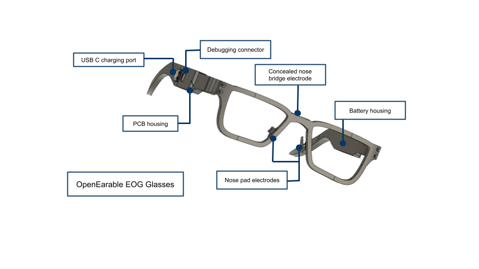
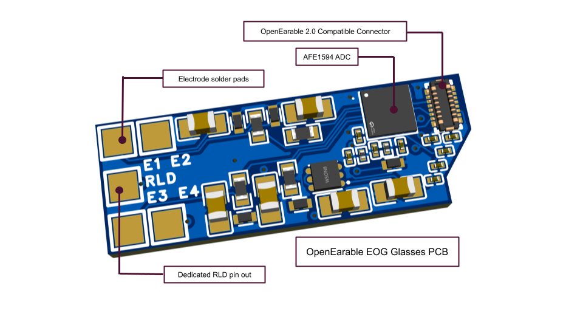
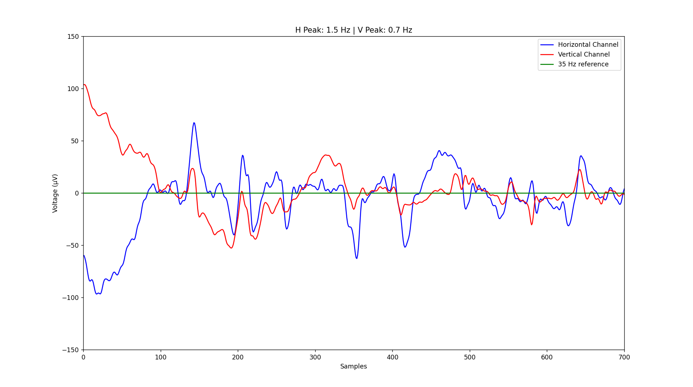
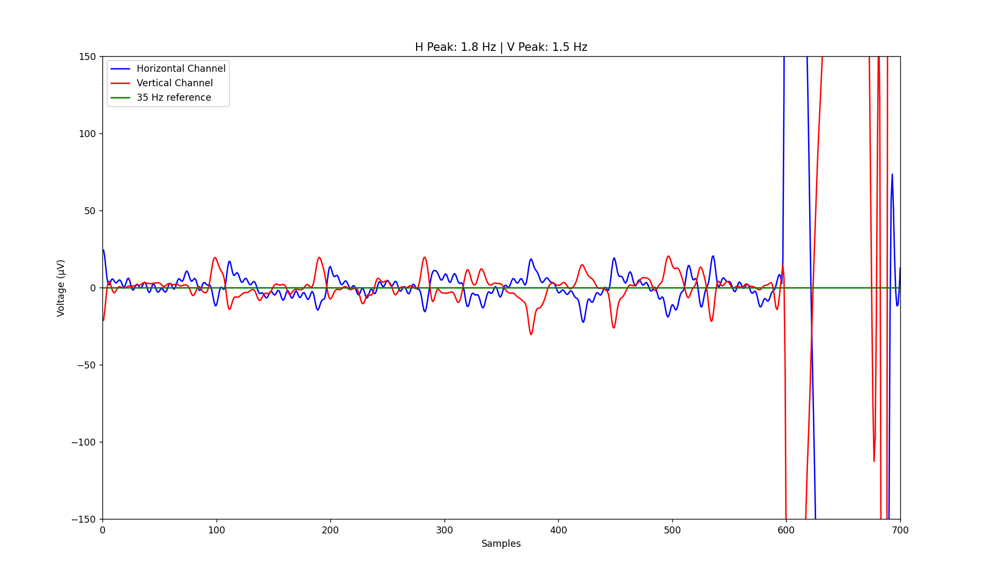
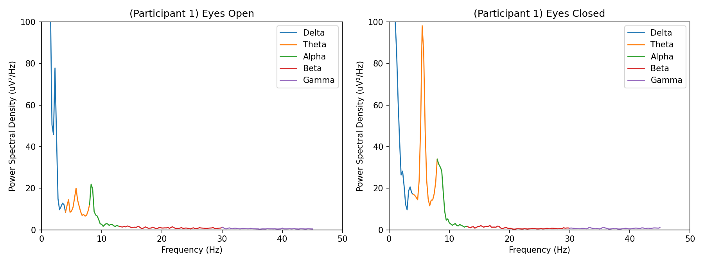
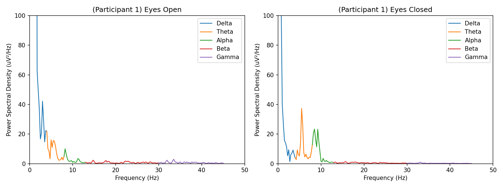
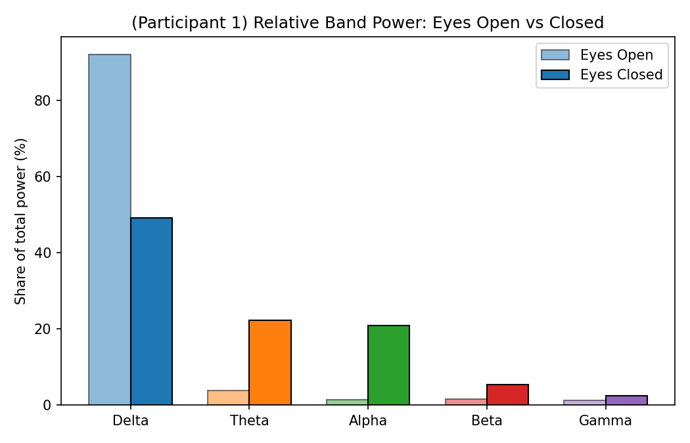
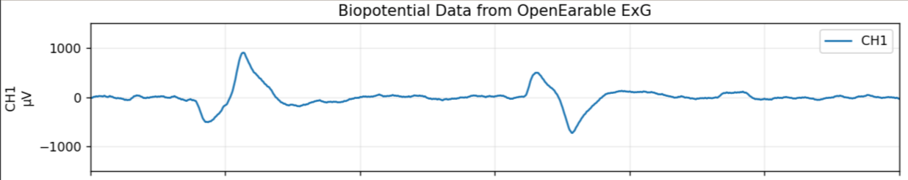

# OpenEarable EOG Glasses

Open-source eyeglasses-form-factor hardware for tracking eye movements via electrooculography (EOG), built as an extension of the [OpenEarable](https://github.com/OpenEarable/open-earable-ExG) and [OpenEarable 2.0](https://github.com/OpenEarable/open-earable-2) platforms.

The project places three dry electrodes directly into the frame of a pair of glasses: one electrode in each nose pad, and one electrode in the bridge. This montage picks up the corneo-retinal dipole as the eyes move, which shows up as small voltage changes on the surrounding skin. Those signals are amplified, filtered, and streamed off the glasses over BLE, where they can be classified into discrete eye movements (looking left/right, up/down, blinks, etc.).

  
  

This repository is a hub — the `main` branch itself contains no code. Each hardware/firmware/software iteration of the project lives in its own branch, described below.

## How the signal looks

**Horizontal eye movement** — the horizontal channel (plotted in blue) tracks side-to-side eye motion. A positive-going spike corresponds to looking left, and a negative-going spike corresponds to looking right.

  

**Vertical eye movement** — the same setup, but with the wearer moving their eyes vertically instead of horizontally. A positive-going spike corresponds to looking up, and a negative-going spike corresponds to looking down.

  

Note that due to the electrode placement horizontal data points mirror movements in the vertical data points (ie. changing gaze vertically affects both lines). However, vertical data points have greater magnitude than horizontal ones during vertical eye movement and horizontal eye movements do not trigger similar responses for vertical data points, making it possible to clearly distinguish which direction the user moved their eyes.

**Alpha band response (eyes closed)** — on the v3 hardware, closing the eyes produces a clear, noticeable spike in alpha-band power compared to eyes open, visible both in the raw channel and in the band-power comparison.

  
  

  

**Right leg drive (RLD)** — Version 3.0 enables a right leg driver which greatly enhances signal quality. With right leg drive active, the baseline is noticeably smoother/cleaner and features very few oscillations. During eye movement, disruptions to this norm are clear and pronounced. As with the horizontal channel, positive is left and negative is right.

  

## Power

The glasses run on a 0.5 Wh rechargable battery, which provides a minimum of 3 hours of consecutive use.

## Branches

| Branch | OE Version | Board Type | ADC | Channels (used/total) | Electrodes | Special Features | Complete | Testing | Notes |
|---|---|---|---|---|---|---|---|---|---|
| [`v_one`](https://github.com/ryanadalal/TECO-Glasses/tree/v_one) | 1.0 | Monolithic | AD7124 w/ custom instrumentation-amp front end | 2 / 3 | Datwyler soft pulse electrodes | Exposed I2C pins for future expansion | Yes | Passed | |
| [`v_two`](https://github.com/ryanadalal/TECO-Glasses/tree/v_two) | 2.0 | Expansion | AD7124 w/ custom in-amp setup | 2 / 3 | `a`: Datwyler soft pulse electrodes. `b`–`e`: 3D-printed metal electrodes | Exposed I2C pins for future expansion | Yes | Passed | Fatal flaw: can not be assembled as is - PCB connector is rotated 180°, so the board fails to connect to the OE2 mainboard |
| [`v_three`](https://github.com/ryanadalal/TECO-Glasses/tree/v_three) | 2.0 | Expansion | AFE1594 | 2 / 2 | Same as v2 | Right leg drive and configurable gain | Firmware incomplete | Incomplete | Library for AFE complete, OE firmware does not integrate library yet |
| [`afe-expansion-board`](https://github.com/ryanadalal/TECO-Glasses/tree/afe-expansion-board) | 2.0 | Expansion | AFE1594 | X / 4 | 6 exposed electrode pins | v3 features + exposed I2C and GPIO | Firmware incomplete | Incomplete | Same as v3 | |

### `v_one` — OpenEarable ExG Glasses v1

The original, fully working version of the project, built on the original OpenEarable. This is a **monolithic board**: the ADC, amplification, and BLE hardware all live on a single custom PCB integrated into the glasses frame, rather than plugging into a separate mainboard. The branch contains everything needed to build one from scratch: custom firmware, a Python BLE client and DSP/filtering pipeline, the PCB design, and 3D-printable CAD models for the frame.

It's built around the **AD7124** ADC with a custom instrumentation-amplifier front end, and exposes 3 electrode channels (this project uses 2 of them). The extra channel and general headroom on the board mean it's also capable of handling additional sensor attachments in the future, such as a PPG sensor.

### `v_two` — OpenEarable ExG Glasses v2

Ports the design to the OpenEarable 2.0 platform. Unlike v1, this is an **expansion board** that plugs into the OE2 mainboard rather than a standalone monolithic board. Like v1, it includes custom CAD models, client software, and a PCB, and is also built around the AD7124 ADC with a custom in-amp setup and 3 available channels (2 used), with the same room for future expansion (e.g. a PPG sensor).

The CAD went through several design iterations (`a` through `e`). Version `a` uses Datwyler soft pulse electrodes with standard electrode clips; versions `b` through `e` switch to 3D-printed metal electrodes integrated directly into the frame for a more compact build.

**Known issue:** the connector footprint on the v2 PCB is rotated 180° from where it needs to be. This is a fatal flaw — the board cannot physically connect to the OE2 mainboard as designed, so this branch is not currently usable as-is.

### `v_three` — OpenEarable ExG Glasses v3

Reuses the same 3D models and client software as v2, but moves to the **AFE1594** ADC in place of the AD7124, which enables significantly better signal quality in a more compact, efficient form factor. It exposes 2 channels and integrates a right leg drive (RLD), which is what produces the cleaner baseline shown in the RLD plot above.

**Status:** incomplete. The PCB design itself is finished but has not been tested, and while the AFE1594 driver library is fully developed, it has not yet been integrated into OE2 firmware.

### `afe-expansion-board` — General-Purpose ExG Expansion Board

Not part of the EOG glasses line — this is a general-purpose ExG expansion board for the OpenEarable 2.0, though it could be adapted for EOG use as well. It's also based on the AFE1594 ADC, but is physically larger than the v3 board, giving it 4 channels total (2 more than v3) and 6 exposed electrode pins (2 more than v3). It includes configurable gain settings, a right leg drive with a dedicated output pin, and exposed I2C pads for future sensor expansion (e.g. a PPG sensor).

**Status:** incomplete, in the same way as v3 — the AFE1594 library is complete but has not yet been implemented in the OE2 firmware for this board.

## A note on the RLD electrode

None of the current boards have a right leg drive electrode built into the glasses frame itself (v3's RLD uses the electrodes already present). There's room to add a dedicated RLD electrode into the side of the frame in a future revision, but this has not been implemented yet.
